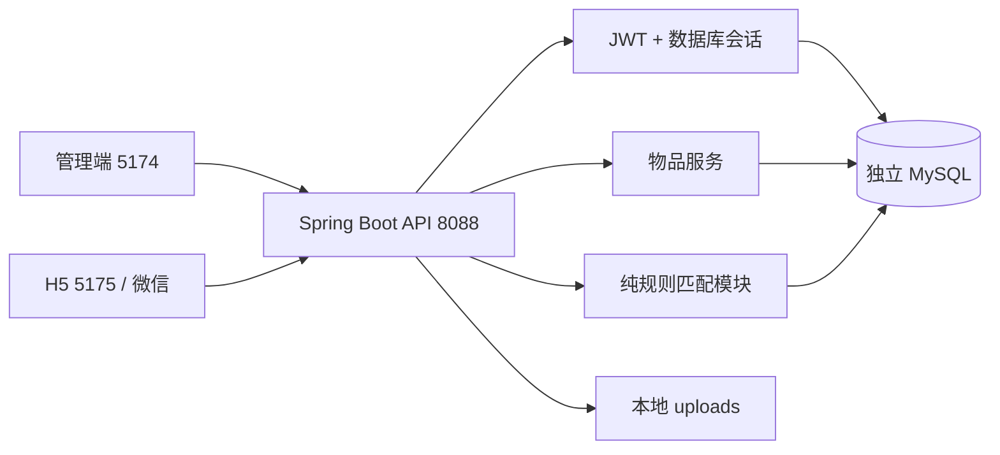

# 架构与业务边界

Campus Loop 使用单仓库三端结构。管理端 Vue/Element Plus 与用户端 UniApp 通过 JSON REST API 访问 Spring Boot。后端保留 `sys-project-com` / `sys-project-api` 与 controller → service → mapper → entity 分层，MyBatis-Plus 分页、Bean Validation、统一错误、JWT/BCrypt 和 MySQL 持久化；Flyway 版本迁移是结构唯一来源。

H5 和管理端开发代理避免不必要的跨域；微信直接配置 API URL。前端不读取数据库或 JWT 密钥。业务服务不依赖外部 AI。JWT 会话到期和退出由服务器验证，角色来源于数据库，不能相信客户端传入的 role。

本人资料更新只对登录用户的 `display_name` 做定向更新并从数据库回读，不能用客户端 DTO 或请求前读取的完整用户对象覆盖 `id/username/role/status/password_hash`。修改密码先校验当前密码，再在一个事务内更新 BCrypt 哈希并删除该用户全部会话；当前请求成功后也必须重新登录。登录和改密都以同一用户行为锁边界：旧密码登录若先完成，其新会话会被随后改密删除；改密若先完成，后续旧密码校验失败。这样避免“删除会话后并发旧登录又插入有效会话”的竞态。

管理员启停账号也复用用户行锁，并用 `cl_user.version` 条件更新避免两名管理员静默覆盖。所有启停写操作先按用户 id 顺序锁定管理员账号，重新确认操作者仍为可用管理员，再锁定目标账号；这既串行化“两个管理员互相停用”的管理入口竞态，也与只锁单一账号的登录形成一致顺序。当前管理员不得停用自己，最后一个可用管理员不得停用。停用状态、全会话删除和不含敏感认证材料的审计同事务提交；启用不恢复已删除会话。

注册采用默认关闭的准入模式。只有显式启用 `DEVELOPMENT_SELF_SERVICE` 时，服务端才在事务中将经过校验的公共字段写成唯一用户名、BCrypt 哈希及固定 `USER/ACTIVE`；客户端不能提供角色、状态、密码哈希或其他用户字段。数据库用户名唯一约束是并发最终防线，冲突整笔回滚为409。成功注册不创建会话，仍通过现有登录流程验证账号状态并建立数据库会话。此开发模式不证明校园身份；校园身份提供方、邀请码或公开准入在获得团队决策与授权配置前保持未实现。

## 数据模型

| 实体 | 当前/后续 | 字段与约束 |
| --- | --- | --- |
| 用户 | 当前 | id、唯一 username、密码哈希、displayName、ADMIN/USER、status ACTIVE/DISABLED、version |
| 账号状态审计 | 当前 | target、operator、前后状态、理由、前后版本、记录时间；不保存口令或令牌 |
| 登录会话 | 当前 | token id、用户、到期；注销删除当前会话行，验证签名后检查有效会话 |
| 分类 | 当前 | id、name、status、sortOrder、version；物品与需求保留非级联引用 |
| 物品 | 当前 | owner、title、description、category、condition 1–5、tags、imageUrl、AVAILABLE 等状态、version、时间 |
| 物品附带需求 | 当前最小实现 | wantedCategoryId、wantedTags；每件物品一条需求，构成“我有/我想要”的可运行样例 |
| 独立需求清单 | 当前（B-01已合入） | demand id、owner、category、description、preferredTags、ACTIVE/INACTIVE/DELETED、version、UTC 创建/更新时间；允许无物品 |
| 需求候选关联 | 当前（B-01已合入） | unique(demand,item)，复用 cl_item；多对多、0–100项；本人 AVAILABLE 且无占用才能建立，不产生占用或所有权 |
| 交换及参与者 | A-03创建，B-03参与者读取/确认/取消 | exchange id、creator、state、expiresAt、version、idempotencyKey；participant unique(exchange,user)，offeredItem，receivedItem，confirmedAt，handoverAt |
| 有效占用 | A-03 | item_id 唯一、exchange_id、expires_at；所有流程统一锁定顺序 |
| 履历事件与证据 | 预留模型/后续实现 | item、eventType、statement、sourceLevel、sourceUser、relatedExchange、occurredAt、recordedAt、证据引用 |
| 物品审核 | A-02 第四批 | cl_item.review_basis、cl_item_review_audit；提交/决定/下架快照、版本与操作人；无审计修改/删除接口 |
| 举报/争议/履历审核 | 后续 A/B/C | report、reporter、target、reason、evidence、assignedAdmin、status、decision、version、时间与审计记录 |
| 收藏 | 当前 A-02 后端，D-02待接入 | cl_favorite，unique(user,item)、收藏时间、非级联用户/物品外键；只读本人列表、幂等添加/取消 |

实际已建表以版本迁移 SQL 为准；概念模型不能视为接口已经可写。V7 新发布为 PENDING_REVIEW，旧公开记录保留 LEGACY_DIRECT；审核与两端兼容改动同批发布。

### 分类目录维护与引用锁

A-02 新增 V6，仅扩展一级分类。ACTIVE/INACTIVE控制后续物品与需求选择，不回写历史物品/需求状态，不改变现有推荐候选规则。名称 trim、小写归一唯一，sortOrder/id升序；PATCH/DELETE校验version，重名或旧版本409。删除必须没有任何物品category/wanted或需求category引用，墓碑与隐藏记录同样保护；保留原外键，不能级联清空。历史读取继续解释当前分类名称。

业务事务复用 CategorySelectionService 按分类ID升序加锁并验证ACTIVE，保持到引用写入提交。统一顺序为需求所属用户（需求写入时）→需求行（如有）→已有物品及占用（按物品ID）→所选分类（按分类ID）；分类维护只锁分类，READ_COMMITTED下非锁定统计引用，不反向锁物品或需求。这样停用/删除先提交时业务复核失败，业务先提交时删除看到引用而409；数据库外键最终兜底。细节和消费方边界见 [A-02 分类说明](a02-category-maintenance.md)。

### A-02 本人物品写入边界

本人分页和详情直接由服务端会话限定当前 owner，可查看七种物品状态；公开读取仍只包含 AVAILABLE/RESERVED/EXCHANGED。完整编辑允许 AVAILABLE/PENDING_REVIEW/REJECTED，并进入待审；下架仅限 AVAILABLE。二者都必须无占用、无 AWAITING_CONFIRMATION/READY/DISPUTED 交换引用。HIDDEN 保留记录，本轮不恢复、不编辑；DRAFT/RESERVED/EXCHANGED 不可通过本人接口修改。A-03已共用B-03端口实现正式创建，物品保护由统一ItemMutationGuard处理。

写事务使用 READ_COMMITTED，先锁 cl_item 行，再检查占用行及进行中的参与者引用，以免读取等待锁之前的旧快照；按 id/owner/status/version 条件更新并数据库回读，version 每次成功加1。过期占用不能由此清除。未来交换写入必须先按物品ID升序锁定相关物品，再写占用/参与者及物品状态；其他所有权、审核或交换物品变更必须同步推进物品 version。本人接口不锁 exchange 行，避免反向嵌套交换锁；不更新/删除需求关联、参与者、占用或履历。第一批使用 V1/V2；第四批 V7 在同事务追加 SUBMIT/WITHDRAW 审计，不硬删记录。详见 [A-02](a02-own-items.md)。

### 物品审核与迁移（V7）

用户已确认：新发布待审；未占用 AVAILABLE/PENDING_REVIEW/REJECTED 完整编辑后复审；仅 PENDING_REVIEW 可批准或驳回。审批事务锁定物品、校验 version、复用 ItemMutationGuard 检查所有占用行与进行中交换引用，再条件更新 status/review_basis/version；成功数据库回读。审批不修改交换、履历、需求、占用和 owner；不能恢复下架物品。

V7 保留旧 AVAILABLE 的公开/推荐及 RESERVED/EXCHANGED 的状态，标记 LEGACY_DIRECT，不等于人工批准；其他旧状态 UNREVIEWED，全部旧版本不变。新演示夹具同样明确为历史直发。第一次编辑将旧内容快照记入审计再提交待审，不静默洗掉原始记录。

cl_item_review_audit 记录 SUBMIT/APPROVE/REJECT/WITHDRAW，内容前后快照、前后状态/版本、操作者及当时显示名、理由、UTC时间；unique(item_id,new_version) 和 RESTRICT 外键约束。只提供 ADMIN 分页读，不提供覆盖或删除接口；本人只读最近一次决定字段（带被审核版本），其他公开/收藏/推荐读取不披露私人审核理由。具体字段、迁移顺序和C/D/B影响见 [审核接入说明](a02-item-review.md)。

## A-02 收藏持久化

收藏是当前会话用户的私有关系，V5新增 cl_favorite，不复制物品内容，不影响需求、推荐、占用或所有权。添加复用公开物品可见性 AVAILABLE/RESERVED/EXCHANGED；本人非公开物品也不能经收藏接口读取。取消只删除本人关系，物品隐藏或不存在仍成功，不泄露目标存在性。

添加/取消在 READ_COMMITTED 事务先锁目标物品，再查/写当前用户关系，重复添加保留原时间，unique(user_id,item_id) 是数据库最终约束。同目标的收藏写入会串行，避免重复添加以及添加/取消或下架竞态；列表在 REPEATABLE_READ 只读快照内按关系分页，再批量复用公开 ItemView。不可见目标仅返回 itemId、收藏时间、itemVisible=false 和 item=null；total包含所有本人关系及占位，其他用户不能查看。没有物品写入或推荐算法改动。详见 [A-02 收藏接入说明](a02-favorites.md)。

## B-01 独立需求边界

独立需求和物品附带需求按入口分离：新 CRUD 只写 cl_demand/cl_demand_item，旧发布与推荐只读写 cl_item 的 wanted 字段。不迁移、不双写、不自动清空旧 wanted 字段。停用独立需求不改变旧演示推荐；B-02通过下文的显式新入口接入算法。

需求创建默认 ACTIVE，允许空候选集合。编辑、状态切换和逻辑删除锁定需求行并核对 version，更新成功 version+1；替换候选在同一事务内按 item id 升序锁定现有物品，复核归属、AVAILABLE 和无占用。候选可被本人多条需求共享，基数不代表未来交换允许复用物品。读取实时展示 offerable；物品状态、占用或归属变化不会自动改写需求，后续匹配与创建必须重新校验。

INACTIVE 可查可编辑，可切换 ACTIVE（恢复前重校验关联）。DELETED 是接口不可恢复的墓碑，保留内容、原关联和 ID 供历史引用，普通查询/写入返回404；不提供物理删除操作。关联外键采用 RESTRICT，后续持久引用也必须保留非级联外键，不能级联删除历史需求。A-03的cl_exchange_demand引用冻结进行中交换所选需求，检查在需求行锁内完成；不反向锁exchange，终态后保留历史引用与快照。

需求结构使用 V4，接在 main 的 V3 用户状态管理迁移之后，不改写 V1–V3。A/D 的候选基数复核仍待团队确认。B-02本分支的显式来源、多需求选择与规则版本见下文；消费复核单独跟踪。requiredTags/最低成色继续不开放、不启用。详见 [B-01 接入说明](b01-independent-demands.md)。

## 可解释的匹配

将每件可交换物品作为候选节点，边 `A → B` 表示 **A 的物品满足 B 的需求**，而不是 A 想要 B 的物品。一个环内用户和物品都唯一，每人只提供一件。

硬条件：状态 AVAILABLE；有效物品和用户；不同所有者；提供物品分类等于接收者 wantedCategory；标签是偏好，不作为排除条件。第一版不使用价格、外部 AI 或无法解释的向量相似度。成色展示但本版不参与硬筛选；后续可增加明示的最低成色需求。

枚举长度 2 和 3 的简单有向环；以环的最小旋转序列去掉不同起点，保留方向。相同一组人选择不同物品可构成不同方案。评分 = 60 + round(10 × 每条流向命中标签数（上限4）的平均值)，范围60–100；先分数降序、再环长度升序、再规范化ID排序。标签去空白、忽略大小写并去重。推荐输出每条流向、参与者、被满足的分类/标签和原因。

种子中的虚构同学叶、蓝、月提供不同物品。例如叶的书籍 → 蓝、蓝的音箱 → 叶可双向交换；叶的书籍 → 月、月的球拍 → 蓝、蓝的耳机 → 叶构成三方循环。数据来自本地幂等种子，不是真实校园用户。

读取推荐只查询，不建立交换、不更新状态、不锁定物品。当前实现限定最多200件AVAILABLE物品、1000条推荐，任一超限返回422，不隐式截断候选或结果。匹配器在构建第1001条推荐的解释对象前中止，限制密集环的内存增长；正常范围内保留完整结果和原有排序。管理概览在规模超限时保留基础计数，推荐数量标为不可用。它适合小规模校园开发数据，不能把全量 O(n³) 搜索当作无限规模方案；后续按分类建立邻接表、限定候选集/分页和缓存，保证缓存不作为交换创建依据。

## B-02：显式独立需求规则 independent-v2

B-01实际模型已随PR #4合入，V4是需求结构来源。B-02不新增迁移，保留旧公开 `/api/matches` 的物品wanted字段来源（legacy-v1），新增登录后的 `/api/matches/independent` 仅使用独立需求并只返回含当前用户的环；没有自动混合、回退或新旧双写。独立需求停用/删除只影响新入口，旧演示仍使用旧入口。

适配层先在一个只读REPEATABLE_READ快照内读取全体AVAILABLE、ACTIVE用户、无占用的物品，执行原200件上限，再读取ACTIVE需求与关联。关联须属于该物品当前owner；空关联、停用/删除、物品下架/审核/占用、账号失效或owner漂移会排除对应候选。无FOR UPDATE或写入，不把推荐当作正式创建的依据。

纯模块 `IndependentDemandMatcher` 接收不可变物品/需求快照。边 A→B 只匹配 B 在环内提供物品所关联的需求；不假设 B 的任意其他物品都可交换。每条边按标签计分贡献 `min(交集数,4)` 最大、同贡献需求ID最小选一条；输出该 demandId、全部命中需求ID、分类和所选需求命中的标签。不同需求不能并集加分，需求组合不重复展开同一个物品有向环。

先计算并复用有向边，再以当前用户的每件物品为起点枚举2/3环，避免先构造无关用户的所有方案。输出时旋转到最小物品ID生成 `independent-v2:cycle-...`；保留方向，反向三环分开。评分及score降序/length升序/ID字典序沿用旧算法，读取不生成任何交换、状态或占用。显式版本用于解释规则，不是预约凭据。

资源保护均整次返回422：200件可交换物品、20000条有效需求关联、1000个返回方案、全响应流向的命中需求ID累计20000项，任一超出不返回部分结果。新增上限和多需求展示选择已在 [Issue #7](https://github.com/429res/campus-loop/issues/7) 同步，D消费复核仍待完成。分类硬匹配、标签软排序按本次明确范围保持；requiredTags/最低成色没有字段、规则或版本启用变更。详情与虚构样例见 [B-02说明](b02-independent-matching.md)。

## 正式交换的事务和并发设计（A-03与B-03共用）

1. `POST /api/exchanges` 复用B的严格命令、ExchangeApplicationService和ExchangeCycleValidator，A提供唯一ExchangeCreationTransaction实现。身份来自会话；推荐是前置条件，不能作为可交换证明。
2. 新事务READ_COMMITTED：先无锁发现当前owner作为锁线索，按用户ID升序锁定（含发起人），检查发起人ACTIVE并识别同键摘要重放；新请求重校验其他用户。再按所有有效关联需求及请求需求ID升序锁定，物品ID升序锁定并检查占用/进行中引用。锁后owner不在已锁集合则409，不追加乱序用户锁。需求新增/修改/启停/删除先锁owner用户，因此完整选择输入（含新需求、未选需求、关联）直到提交都稳定；B校验器重新选择流向与需求，版本、归属、状态、2/3环及流向任一失效整体拒绝。
3. V8仅扩展V2：保存规则、SHA-256规范化摘要、创建快照与精确需求引用/快照；旧行保留NULL，不猜测重放。原子创建AWAITING_CONFIRMATION/version=0、全员PENDING，按物品升序写唯一占用并置RESERVED/version+1，保留审核信息。锁后数据库UTC+24h为原截止，MySQL连接会话固定UTC。相同发起人/键/摘要先返回原交换，不重校验已被本次占用的物品、不延长截止；同键异内容409。约束错误在事务回滚后转409；瞬态并发错误最多三次独立事务，耗尽409。需求冻结检查只读进行中交换引用，不反向锁exchange。推荐GET没有锁或写入。完整边界及证据见[A-03说明](a03-exchange-transaction.md)。
4. `POST /{id}/confirm` 仅参与者可执行；在锁定 exchange 后检查 version/state/deadline，重复确认幂等，全部确认后进入 READY。占用在创建事务开始，不能等到各方确认后才分别抢占。
5. 双方或三方分别提交交接确认。全部完成时，同一事务更换物品所有者、关闭旧需求、写入不可覆盖的履历、释放占用并置 COMPLETED。履历来源初始是参与者确认，不能自动升级为管理员核验。
6. 确认截止前可取消；取消与超时任务使用相同 exchange 行锁与条件状态更新，仅释放属于该 exchange 的占用。重试任务幂等。交接开始后不能简单取消，进入争议流程，避免已交付物品被自动重新上架。
7. 超时使用数据库 UTC 时间、批次扫描和可恢复任务，UI 倒计时只展示。version 乐观锁用于编辑与条件状态变更，唯一占用约束作为最终防线。数据库死锁按有限次数重试，外部通知在事务提交后 outbox 发送。

状态：`AWAITING_CONFIRMATION → READY → COMPLETED`；AWAITING_CONFIRMATION/READY 未交接时可到 `CANCELLED/EXPIRED`；交接阶段异常到 `DISPUTED → COMPLETED/CANCELLED`。创建、确认/取消已接通持久事务；交接仍501，自动超时扫描留待A-04。B-03提供的命令、领域验证、查询被共用，没有第二套创建或状态机。

## 履历可信度

`SELF_REPORTED`：发布者自述，记录作者与声明时间；`BOTH_CONFIRMED`：关联交换及各参与者独立确认时间；`ADMIN_VERIFIED`：记录核验管理员、证据、范围及时间。用户只能提交声明，不能自行设置可信度；后续审核产生新事件，不覆盖原始声明。维修时间与录入时间分别存储，时间未知允许注明未知，不伪造历史。

## 开发隔离与边界

Compose 只监听127.0.0.1，数据库端口3308，应用8088；上传目录在项目 `.local`。每位成员有自己的库和本地账号。Flyway 不含 DROP 或清空语句；演示数据只在本地初始化打开时插入。默认测试 H2，MySQL CI 使用独立临时 `_test` 库。上传默认本地文件存储，OSS、微信身份登录、消息通知均为后续适配。

## B-03 第一切片：读取与A/B实现边界

本人分页/详情使用同一REPEATABLE_READ只读快照，按持久参与者关系授权；发起人字段本身不替代参与者资格，ADMIN也不能绕过私有入口。以持久offered_item_id/recipient_user_id重建收到的物品，保留反向三环，不按当前owner改写历史。仅读取V2已有事实，不拼入物品后来变更的私有内容；无历史快照时不虚构需求ID/规则版本。allowedActions来自共用规则，到期读取不执行过期处理。C管理读取路径仅是独立草案。

A-03基于已合入的B-03 PR #28实现唯一事务端口，复用其ExchangeDomainIntegrationTest增加真实创建、冻结、回滚及MySQL争抢测试。V8由A提供；B邀请规则分支未新增迁移或另一条创建路径。B-02新增物品/所选需求版本元数据，仍是independent-v2分类硬、标签软；纯校验器重用相同选中需求规则，过期命中不能自动替换。详见 [B-03说明](b03-exchange-domain.md) 和 [Issue #25](https://github.com/429res/campus-loop/issues/25)。

## B-03.2 / A-04 共用生命周期

单一ExchangeLifecycleService以ExchangeLifecycleRules决定确认、取消、到期，读取用相同参与事实和规则生成allowedActions。创建与生命周期共享ExchangeTransactionExecutor、ExchangeDatabaseClock，保留A-03的READ_COMMITTED/整事务有限重试。已有exchange先锁，再用户升序→需求升序→物品/占用升序；必要锁全部取得后再次读数据库UTC，严格小于原expiresAt才允许新用户动作。

READY未交接且原24h截止前，任一参与者可取消；全员独立确认才READY。重复确认/精确取消重放不增加事件/版本或重复释放，新动作检查version。交换锁串行确认、取消、到期；V9审计事件按exchange/new_version唯一。释放核对持久流向、创建时版本、当前RESERVED/owner/version、占用集合与exchange归属及其他进行中引用，然后仅条件删除本交换占用、保留所有权恢复AVAILABLE/version+1；任何失败整笔回滚。

旧无V8创建依据记录继续只读，V9不伪造历史取消信息。取消字段仅参与者详情可见，管理读契约不带代确认权。A-04后续扫描调用相同expire入口，尚无扫描/批次/重启恢复；交接/所有权转移留后续。完整矩阵、迁移与证据见[B-03.2](b03-invitation-rules.md)。
