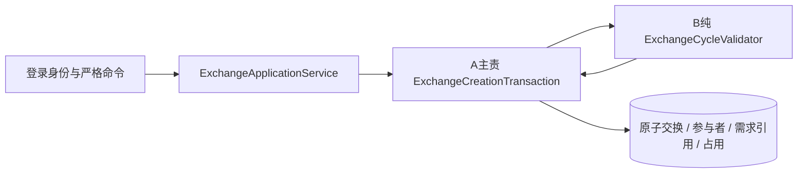

# B-03 第一切片：领域入口、详情与本人列表

基线 main `7d5e515`，B-02 [PR #11](https://github.com/429res/campus-loop/pull/11) 和 A-02 审核 [PR #24](https://github.com/429res/campus-loop/pull/24) 已合入。分支 `feature/b03-exchange-domain`；交付前同步main `052ecc8`，保留D-02 PR #22的独立理由和收藏接线。协作 [Issue #25](https://github.com/429res/campus-loop/issues/25)；当前没有A-03实现/关联PR，A在协作任务明确核对并确认，不是按分支命名猜测。

## 本切片实际交付与未接通边界

- 已实现：严格创建命令、规范化请求摘要、纯领域环验证、无锁数据库核查适配器；本人分页和参与者详情、隐私/版本/流向测试；独立推荐返回创建所需前置版本。
- 已声明唯一A事务端口，但没有实现bean。合法 `POST /api/exchanges` 仍501，data=null，无交换/参与者/占用写入；没有第二套创建服务或表，没有新增迁移。
- A-03尚未可用，因此正式创建、幂等存储/重放、24h截止的事务落地、精确需求历史引用与冻结、并发争抢和失败回滚验收仍未完成。请求摘要测试不能替代数据库幂等验收，数据库交换夹具回读不能替代创建成功。
- 参与者确认、取消、交接和自动超时继续待开发，原预留动作501。本批不标记整个B-03或A-03完成，也未做前端接线。

## 已明确的产品规则

任务发起人在本次会话明确采用：发起人也不自动确认；全员初始PENDING、AWAITING_CONFIRMATION/version=0；截止为数据库UTC创建时间+24h；幂等按发起人/键，同键异请求409；只支持independent-v2；进行中交换所引用需求禁止编辑/启停/删除。规则已同步A，不再列为待批准的默认值。

一个环2或3人、每人一件、用户和物品唯一，物品AVAILABLE且用户ACTIVE，无任何占用（包括过期行）或进行中参与者引用。方向为提供者物品满足接收者需求，接收者的该需求必须关联自己在本环提供的物品。分类硬、标签软；requiredTags/最低成色未启用。域校验重用IndependentDemandMatcher的选中需求规则，不重新实现另一套排序或流向匹配。

## 与A共用的唯一入口



图中的A事务和写入尚未实现。B的ApplicationService只调用一个端口并在提交后回读，不自行开另一条写路径；缺少端口实现就501。ExchangeCandidateReader只有读取适配能力，没有公开预检接口，其结果不是写入许可。A须在锁内重建IndependentMatchingInput并调用ExchangeCycleValidator；物品版本必须显式传入，不允许缺省填0。

A已复核：新请求采用所选需求ID升序 → 物品ID升序及占用 → 必要分类ID升序，与现有需求编辑一致。已有交换动作exchange锁在前。用户行锁、幂等锁/唯一键与外键隐式锁的完整顺序、死锁有限重试需A-03实际验证。新需求插入、未选中需求的标签/分类修改、关联改变与规则重选的竞争也必须覆盖，锁内须稳定完整的需求选择输入；不能仅锁物品而反向等待需求。需求冻结在需求锁下以READ_COMMITTED查询进行中引用，不反向锁exchange。

A必须先识别同键重放：相同发起人/键/规范化摘要返回原交换，不把首次创建的RESERVED/版本递增当作过期，不延长原截止。同键不同摘要409；新请求锁内验证itemVersion/demandVersion、有效归属/关联与当前所选需求，变化409且不自动选另一需求。规范化将整条流向连同版本和需求绑定旋转至最小物品ID，保留方向；反向三环不同。SHA-256摘要包括ruleVersion及这些绑定字段；身份/键作为外层作用域，客户端理由、分数、参与者和状态根本不接收。

A复用V2的cl_exchange/cl_exchange_participant/cl_item_hold，负责后续迁移保存摘要、规则版本、精确所选需求和历史快照，非级联外键保护历史引用。迁移号未预占。首次创建原子写参与者/占用及物品RESERVED/version+1，保留reviewBasis和审核审计；检查任何占用及AWAITING_CONFIRMATION/READY/DISPUTED引用，不释放过期或其他交换占用。开放写入前必须同时落实所选需求冻结。A-03提供后，在其共用MySQL测试上增加域断言，不另做一个测试创建器。

## 给D的请求与读取样例

完整虚构示例：[b03-exchange-contract.json](examples/b03-exchange-contract.json)。其中200详情是**V2已存读取夹具的契约示例**，不是本轮POST成功的记录；创建示例真实能力为501。

```json
{"ruleVersion":"independent-v2","idempotencyKey":"fictional-request-01","flows":[
  {"itemId":11,"itemVersion":3,"demandId":502,"demandVersion":4},
  {"itemId":22,"itemVersion":5,"demandId":501,"demandVersion":6}
]}
```

含义：叶101的物品11→蓝102，满足蓝需求502（关联蓝物品22）；蓝物品22→叶，满足叶需求501（关联叶物品11）。当前POST返回 `{"code":501,"msg":"A-03 创建事务尚未接入；未创建交换或占用物品","data":null}`。D创建按钮仍显示待开发；不能转到“创建成功”页或用本地对象填出交换记录。A接通后的成功响应才是ExchangeView。

`GET /api/matches/independent` 增量给出participants[].itemVersion和flows[].demandVersion；保持independent-v2及原理由/评分/排序。按flow.itemId找对应participant.itemVersion，flow.demandVersion属于接收者选中需求；flows整序直接保持方向，不能按用户ID排序。旧响应缺版本就刷新，不去读取他人私有需求详情、不补0。

- `GET /api/exchanges/mine?page=1&size=12&status=AWAITING_CONFIRMATION`：真实服务端成员分页，total只算本人。超页records为空而total不清零；createdAt/id降序。
- `GET /api/exchanges/9101`：只有持久参与者可读。详情与列表共用ExchangeView，participants/flows从最小物品ID起按方向排列，未必以当前用户开头。三方11→22→33→11，分别由101→102→103→101提供；收到物品按前一流向计算，不能当作自己提供物品。
- `confirmationStatus=PENDING/CONFIRMED`由confirmedAt映射，时间没有就null；不因发起人身份自动确认。allowedActions只列已经实现的写动作，当前固定空数组，不提供确认/取消/交接按钮。
- expiresAt只展示真实持久UTC时间；读到过去截止也不擅自改EXPIRED或释放。后台到期任务未实现，页面倒计时不替代状态。
- 401恢复会话，400保留选择并修正输入，403停止越权创建，404不透露非本人交换存在性，409保留选择并重新读取；501说明功能未接通，无成功记录。A接通前不能声称同键重试已返回原交换。

只有持久流向ID和参与者时间是真实历史事实；当前公开displayName可能变化。V2未保存物品标题/需求/理由快照，所以当前详情不拼接后来私有标题、说明、审核原因，不虚构历史规则/需求ID。A快照迁移后可补字段；幂等键、摘要、令牌和口令永不返回。

## 给C的读取边界

C-03后续独立ADMIN路径：`GET /api/admin/exchanges?page=1&size=12&status=`、`GET /api/admin/exchanges/{id}`，沿用基础字段并提供真实持久审计/快照，不披露无关用户私有说明。当前路径未注册，404；草案不是可调用能力。本轮ADMIN访问普通详情也必须是参与者，不可由管理员角色代确认。管理页可以先开发契约展示，但不得把本地夹具当作真实审核/确认或调假成功。

## 本次实际验证（2026-09-08）

- `node scripts/run.mjs test`：用户端47项、后端140项通过；后端为52项公共规则+88项API/集成，其中本次新增10项领域、2项DTO、9项隔离集成。原B-02标签/排序/反向/上限测试保留，版本测试增加元数据断言。
- `CAMPUS_TEST_PORT=3331 node scripts/mysql-test.mjs`：全新MySQL8.4.11，Flyway V1–V7成功，后端140项通过。新9项经MockMvc真实认证/MVC/事务/Mapper读取MySQL；涉及用户/物品/需求状态、归属、关联、版本、私有读取、合法2/3环域验证及缺失A端口501。
- 查询及域核查前后逐行比较cl_item/cl_demand/cl_demand_item/cl_exchange/cl_exchange_participant/cl_item_hold六表，无写入变化；测试结束仅清理自身夹具，原始基线逐行保持不变。容器已自动停止删除，未连接日常库或输出凭据。
- MySQL整套还运行既有A-02审核/物品/收藏/分类的并发回归，但它们**不证明A-03创建锁行为**。没有A-03创建并发用例可复用，正式创建/同键重放/争抢唯一成功/失败无部分参与者或占用仍待A-03，不以H2或手写SQL夹具替代。
- 无迁移、依赖或前端页面改动。浏览器/微信交互未执行；构建及云端检查见关联PR。已有Flyway对MySQL8.4支持版本提醒保留，本次既有迁移与真实读取通过。

首轮独立工作树缺依赖导致统一脚本未进入后端，按lockfile安装后已重跑通过；适配新增版本元数据和未注册管理路径404后相关断言已修正并全量重跑。没有通过删掉原规则测试掩盖行为变化。PR需其他成员审核与CI通过，不自动合并main。
